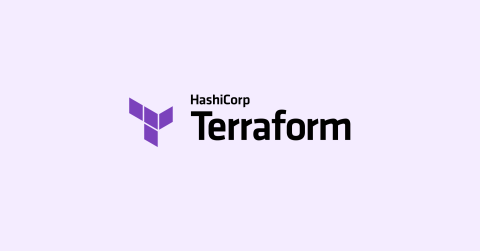

Infrastructure as Code has started to be an important part of our cloud journey, giving us the ability to automate deploys and replicate our infra in multiple environments and accounts. Using code to define our infra allow us to implement some practices from developers world, like testing, version control, etc.

<!-- truncate -->


As a lot of tools, IaC can introduce bugs or maybe miss configurations that then can be our headache when errors arise, or maybe audit companies come to review the security of our infra.

IaC has enabled us to implement development practices like generating Pull Request with the new changes, this is very important when we want the revision from other coworkers, frameworks to do testing and maybe IaC tools that use common language programing help us to validate our infra-code, but this is more for technical teams and translate this to non-technical languages can be complicated, limiting the scope for the revision. Here is when terraform-compliance framework appears to help us to define rules to validate our infra and define if accomplish with the requirements defined from the technical side and business side.

Terraform-compliance is a framework that validates the compliance in our infrastructure defined by terraform, this is based on negative testing and BDD that work together to validate our infra. This post will show how to implement this framework and add it to our DevOps pipeline used to deploy our IaC, AWS will be used as a cloud provider.

### Requirements

Terraform-compliance validates the code before it is deployed, we can install it using docker or via pip. In this post, we will use pip.

- Python
- terraform 0.12+

### How does this work?

Terraform-compliance uses policies that define the features that the infrastructure must-have, like encryption enabled in the buckets, resources well tagged, etc. These policies are executed against the plan that Terraform generates and are defined using  **Behaviour Driven Development(BDD)** Principles, that use English like the language to define the policies.

To work with terraform we need to create a file in which the policies are defined, using BDD principles that file is named feature and contain the scenario that we want to evaluate.
The structure of the file is the following:

**Feature:** A summary about the things to validate
**Scenario/scenario Outline**: define the test to execute, this includes BDD directives like:
**GIVEN:** It is used to define a context that can be a list of resources or data that we want to check, we can see this as a filter.
**WHEN:** filter the context defined above, for instance, if the context defined says that will evaluate all the s3 buckets, with WHEN we can filter by tags for instance. If the condition doesn't pass this just skip to the next line instead of fail.
**THEN:** Has a similar function that WHEN but if the condition doesn't pass the scenario will fail.
**AND:** It is used to define an extra condition to our scenario, this is an optional statement.

Here and example to evaluate if all the resources has tag defined.

  `Scenario: Ensure all resources have tags
      Given I have resource that supports tags defined
      Then it must contain tags
      And its value must not be null`

Each BDD directive has more capabilities and can be checked in [Terraform-compliance documentation](https://terraform-compliance.com/pages/bdd-references/).

The Feature file is executed against terraform plan, to do this terraform-compliance needs the TF plan as an input, for that we need to save our plan in an external file and pass it to terraform-compliance command that we will see later.

With the basic explanation made above let's make and example.

### Hands on

This post was part of a webinar made in my current company and a Github repository was created, [here is the link](https://github.com/danielrive/epam-devops-webinar-2022).This repo contains a few AWS resources defined by terraform and uses Github actions to execute with each push the terraform-compliance framework. All the stuff that we will execute is before the terraform apply so we don't spend money creating resources

.

The project has been divided into two parts, the first one contains the terraform code to deploy the infrastructure and is located in the root of the repo, the second part is a folder named compliance that contains some files with .feature extension and defines the rules that we want to evaluate against our TF plan.

``` hcl
#### Data Sources

data "aws_caller_identity" "ID_CURRENT_ACCOUNT" {}


###  KMS Policy 
data "aws_iam_policy_document" "kms_policy" {
  statement {
    sid    = "Enable IAM User Permissions"
    effect = "Allow"
    principals {
      type        = "AWS"
      identifiers = ["arn:aws:iam::${data.aws_caller_identity.ID_CURRENT_ACCOUNT.account_id}:root"]
    }
    actions = [
      "*"
    ]
    resources = ["*"]

  }
}


##########################
## Secret manager

# KMS ky to encrypt at rest secret manager
module "kms_secret_manager" {
  source = "./modules/kms"
  NAME   = "KMS-SecretManager-${var.environment}"
  POLICY = data.aws_iam_policy_document.kms_policy.json
}

module "secret_manager" {
  source    = "./modules/secret_manager"
  NAME      = "secret_${var.environment}"
  RETENTION = 10
  KMS_KEY   = module.kms_secret_manager.ARN_KMS
}


module "secret_manager_k8" {
  source    = "./modules/secret_manager"
  NAME      = "secret_k8_${var.environment}"
  RETENTION = 10
  KMS_KEY   = module.kms_secret_manager.ARN_KMS
}

resource "aws_s3_bucket" "bucket_test" {
  bucket = "my-bucket-forcompliance-test"

  server_side_encryption_configuration {
    rule {
      /*   
      apply_server_side_encryption_by_default {
        sse_algorithm = "AES256"
      }
      */

      apply_server_side_encryption_by_default {
        kms_master_key_id = module.kms_secret_manager.ARN_KMS
        sse_algorithm     = "aws:kms"
      }


    }

  }

  tags = {
    Name        = "bucket_${var.environment}"
    Environment = "develop"
    Owner       = "DanielR"
  }
}

resource "aws_s3_bucket" "bucket_test2" {
  bucket = "my-bucket-forcompliance-test"

  server_side_encryption_configuration {
    rule {

      apply_server_side_encryption_by_default {
        kms_master_key_id = module.kms_secret_manager.ARN_KMS
        sse_algorithm     = "aws:kms"
      }

    }

  }

  tags = {
    Name        = "bucket_${var.environment}"
    Environment = "develop"
    Owner       = "DanielR"
  }
}

resource "aws_secretsmanager_secret" "secret_manager2" {
  name                    = "test"
  recovery_window_in_days = 10
  lifecycle {
    create_before_destroy = true
  }
  tags = {
    Name        = "test"
    Environment = "develop"
    Owner       = "DanielR"
  }
}
```

Terraform code creates KMS key, Secret managers that are encrypted by KMS and s3 buckets with SSE with KMS.

Compliance folder has three files and each one define a scenario, let's move on with the _S3.feature_ file.

``` bash
Feature:  This validates if the s3 buckets has Encryption enabled using KMS
Scenario: Ensure that s3 buckets are encrypted by KMS
    Given I have aws_s3_bucket resource configured
    When it contain server_side_encryption_configuration
    Then it must have apply_server_side_encryption_by_default
    Then it must have sse_algorithm
    And its value must be "aws:kms"
```

With that file TF-Compliance framework will validate if the S3 buckets created with that TF code have Server-Side-Encryption enabled but using KMS key, here a quick explanation of the file:

- **Given** statement define the context in this case, all the resources defined by **_aws_s3_bucket_**
- **When** statement makes more small the context, in this case TF-compliance will check the buckets that have server_side_encryption_configuration in their definition.
- We have two **Then** statement and are used to defined that the buckets must to have **_apply_server_side_encryption_by_default_** and the **_sse_algorithm_** must be **_aws:kms_**.

### Running the commands

As we mentioned before, we are using Github actions to run the TF-compliance command, the idea is to validate automatically if the rules are accomplished before the plan if so, the pipe will allow the TF apply command and the infra will comply with the rules defined.

To do that, we need to generate the terraform plan, this must be stored in a file in the same directory, then that will be an input for our TF-compliance command.

To do that we can run:

``` HCL
Terraform init

terraform plan -out=plan.out 

```

plan.out is the name of the file to create, we can put any another name.

Once the plan is created we can go ahead with the execution of the TF-Compliance command, here is the command to do the magic

``` HCL
terraform-compliance -f compliance/ -p plan.out
```

With the -f flag we specify the folder in which we are storing the rules(.features files).

The output will be

.

Let's change the code to use the default algorithm to encrypt  the s3 buckets.

``` HCL
resource "aws_s3_bucket" "bucket_test" {
  bucket = "my-bucket-forcompliance-test"

  server_side_encryption_configuration {
    rule {
      
      apply_server_side_encryption_by_default {
        sse_algorithm = "AES256"
      }
      
    }

  }

}
```

Running again the TF-compliance command will be:

.

With this we can validate how the framework works, we can define multiple rules and these can be checked for all the teams because are not 100% technical.
