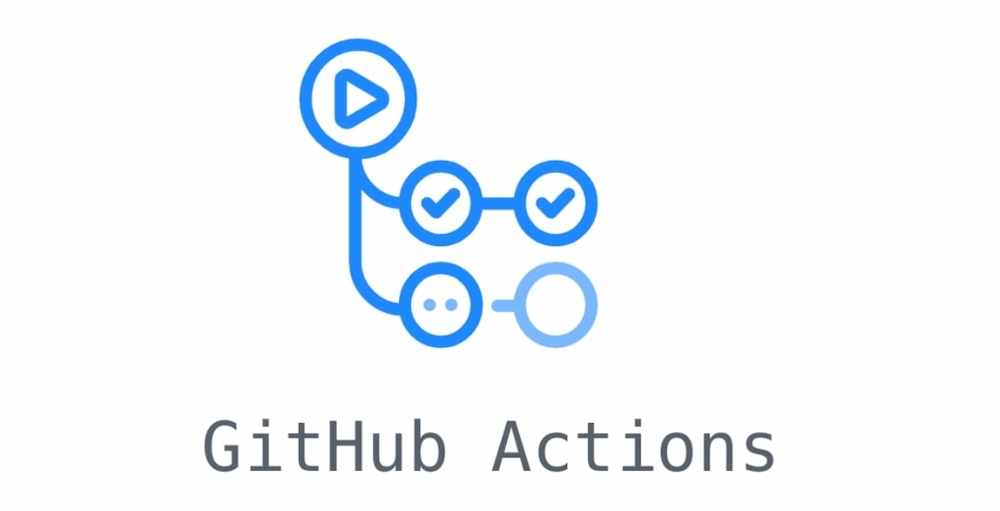

The journey to learn a new tool can be a little tricky, watching videos and reading some blogs can be an option, but watching and reading can not be enough for everyone, personally I need a hands-on approach for effective learning.

<!-- truncate -->

That motivation drove me to embark on a personal project where I could implement the tools I had been using and those I wanted to explore. to initiate this journey I decided to create an application that helped me to follow my expenses, it could be something trivial but I needed a "business case" to begin building a solution.

The general idea is to have an application that helps you track the monthly expenses and filter for a particular category to see where the money is going.

Let's start building the initial infrastructure needed for the application.

[Here](https://dev.to/aws-builders/smartcash-project-gitops-with-fluxcd-3aep) you can find the GitOps implementation(Part 2 of the project).

### Source Code

The version of the code used in this article can be found [here](https://github.com/danielrive/smart-cash/releases/tag/v1.0.0). only specific sections of the code are included here to provide explanations, as this approach avoids the need to paste the entire code.

### Architecture

The image below shows the first version of the architecture to use, I chose Kubernetes for this project as it allows me to explore some tools for K8 and improve some skills to present a K8 certification.


### IaC

Terraform is the tool for IaC, while I won't delve into a detailed terraform code explanation, I will provide some key highlights:

#### Networking

A [third-party](https://registry.terraform.io/modules/terraform-aws-modules/vpc/aws/latest) TF module is used. to save some aws costs the NAT gateways have been disabled.

#### EKS

A TF module has been developed to deploy the resources needed for an EKS cluster. I created manually an IAM user and passed it as a variable(_var.userRoleARN_) to the EKS module. This internally runs an _eksctl_ command to add it to the RBAC configs. This user will be used to operate the cluster locally.

``` Terraform
resource "null_resource" "iam-role-cluster-access" {
  provisioner "local-exec" {
    command = <<EOF
      curl --silent --location "https://github.com/weaveworks/eksctl/releases/latest/download/eksctl_$(uname -s)_amd64.tar.gz" | tar xz -C /tmp
      /tmp/eksctl version
      /tmp/eksctl create iamidentitymapping --cluster ${local.eksClusterName} --region=${var.region} --arn ${var.userRoleARN} --group system:masters --username "AWSAdministratorAccess:{{SessionName}}"
    EOF
  }
  depends_on = [
    aws_eks_cluster.kube_cluster,
    aws_eks_node_group.worker-node-group
  ]
}
```

EKS worker nodes will run in public subnets, this is because I have disabled the NAT GW to save some costs.

## Infrastructure Pipeline

### Branch strategy

I will follow a common branch strategy as the following image shows. The main branch is associated with the production environment.


### GitHub Actions

GitHub actions will be used to implement the pipeline to deploy the infrastructure in AWS, if you are not familiar with GitHub actions terminology you can check the [documentation](https://docs.github.com/en/actions/learn-github-actions/understanding-github-actions).

You can find the YAML files in the _.github_ folder, which also contains other 3 subfolders, let's explore them in detail.

#### actions folder

This folder contains the [GitHub composite Actions](https://docs.github.com/en/actions/creating-actions/creating-a-composite-action) to use in the workflows, you can think of an action as a template that defines the task to execute(jobs). Now let's review the _terraform-plan_ action.

The first part defines the name and the inputs for the action, in this case, I am just defining the working directory where TF is placed as an input.

``` Yaml
name: 'Terraform Plan'
description: 'Running Terraform plan'

inputs:
  WORKING_DIRECTORY:
    description: 'directory where the tf code is'
    required: false
    default: '/infra/terraform'

```

The second part defines the tasks to execute, this action will start installing Terraform.

``` YAML
runs:
  using: "composite"
  steps:
      - name: Terraform install
        id: 'install-terraform'
        uses: hashicorp/setup-terraform@v2
        with: 
         terraform_version: '${{ env.TERRAFORM_VERSION }}'
      - name: Validate terraform version
        id: validate-tf-version
        run: terraform version
        shell: bash
```

Notice that the step _Terraform install_ is using an external GH action, [hashicorp/setup-terraform@v2](https://github.com/marketplace/actions/hashicorp-setup-terraform), the version of this action is specified after the @. This action is available in the [GH actions marketplace](https://github.com/marketplace?type=actions).

The next step is to run terraform init but I won't delve into detail, therefore, let's proceed to the final two steps.

The step _Run terraform plan_ runs the TF plan command passing some variables that are defined in the workflow definition, the plan generated is saved in a file named with the GH actions run id.

Finally, the plan generated in the previous step is published as an artifact, that is used for the action created for the TF apply process.

``` YAML
      - name: Run terraform plan
        id: terraform-plan
        run: | 
            terraform plan \
            -input=false \
            -var 'region=${{ env.AWS_REGION }}' \
            -var 'environment=${{ env.ENVIRONMENT }}' \
            -var 'project_name=${{ env.PROJECT_NAME }}' \
            -out ${{ github.run_id }}.tfplan
        shell: bash
        working-directory: '.${{ inputs.WORKING_DIRECTORY }}'

      - name: Publish Artifact
        uses: actions/upload-artifact@v3
        with:
          name: tf-plan
          path: '${{ github.workspace }}${{ inputs.WORKING_DIRECTORY }}/${{ github.run_id }}.tfplan'

```

#### jobs

This folder stores some bash scripts used in the pipelines to perform specific tasks, currently just one script is stored here, and its purpose is to create the S3 bucket and the DynamoDB tables used for the TF state.

The script runs some AWS CLI commands to validate if the S3 bucket and DynamoDB table exist, if not the resources are created.

A composite action has been created to execute this script, you can find it with the name terraform-backend.

```YAML
name: 'Terraform backend set-up'
description: 'set-up terraform plan'
runs:
  using: "composite"
  steps:
    - name: Config tf backend
      id: tf-backend
      run: ./terraform-backend.sh
      shell: bash
      working-directory: .github/workflows
```

#### Workflows

Workflows define the triggers(commits, tags, branches...) for the pipeline and also specify the process to execute(jobs), inside the workflow you can use the composite actions already defined.

##### Workflow Template

I have created a workflow template that defines the common tasks for all the environments, but this does not define the triggers. let's take a look at the template.

```Yaml
name: terraform deploy template
on:
  workflow_call:
    inputs:
      AWS_REGION:
        description: 'aws region where the resources will be deployed'
        required: true
        type: string
     secrets: 
      AWS_ACCOUNT_NUMBER:
        required: true
```

The initial section defines the inputs and secrets for the workflow, the main difference between inputs and secrets is that Github hides the value of the secret in the workflow logs.

The second part of the template defines some common environment variables.

```yaml
env:
  ENVIRONMENT: ${{ inputs.ENVIRONMENT }}
  AWS_REGION: ${{ inputs.AWS_REGION }}
  PROJECT_NAME: ${{ inputs.PROJECT_NAME }}
  TERRAFORM_VERSION: ${{ inputs.TERRAFORM_VERSION }}
  AWS_IAM_ROLE_GH: 'GitHubAction-AssumeRoleWithAction'
```

You can observe that the value for the env variable AWS_REGION is set to the value passed by the input inputs.AWS_REGION defined earlier. Why it is done? let's review one snippet of code from the composite action for the terraform plan to gain a better understanding.

``` yaml
- name: Run terraform plan
        id: terraform-plan
        run: | 
            terraform plan \
            -input=false \
            -var 'project_name=${{ env.PROJECT_NAME }}' \
```

As you can see I'm using the env variable PROJECT_NAME and passing it as a TF variable, this is possible because in the workflow I defined the value for the variable, and this is passed down in the runner. You can use inputs here but you would need to define the same input in the composite action.

The last part of the template defines the jobs to execute

```yaml

jobs:
## Execute bash script that  create s3 bucket and dynamodb table for Terraform backend
  set-up-terraform-backend:
    runs-on: ubuntu-latest
    steps:  
      - name: checkout-repo
        uses: actions/checkout@v4
      - name: configure aws credentials
        uses: aws-actions/configure-aws-credentials@v4
        with:
          role-to-assume: 'arn:aws:iam::${{ secrets.AWS_ACCOUNT_NUMBER }}:role/${{ env.AWS_IAM_ROLE_GH }}' 
          role-session-name: GitHub_to_AWS_via_FederatedOIDC
          aws-region: ${{ env.AWS_REGION }}
      - name: config tf backend
        id: tf-backend
        run: ./terraform-backend.sh
        working-directory: .github/jobs/
```

The provided code shows the job to set up the Terraform backend, this job is executed in a Ubuntu runner that is defined by runs-on.

Let's check the steps executed for the job.

1. The first step is to make a checkout of the repo into the runner, this is done by an [external composite action](https://github.com/marketplace/actions/checkout).
2. To execute Terraform the job needs access to AWS, this is done by an [external composite action](https://github.com/marketplace/actions/configure-aws-credentials-action-for-github-actions), to avoid pass Access and Secret keys OpenID Connect (OIDC) will be used, which allows GitHub Actions workflows to access AWS. You need to create an IAM IdP in your AWS account and associate it with an IAM role, this role must contain the permissions that Terraform needs to run properly.
The details for the configuration can be checked [here](https://docs.github.com/en/actions/deployment/security-hardening-your-deployments/configuring-openid-connect-in-amazon-web-services).
3. Once the AWS credentials have been configured you can call the composite action created to set up the Teraform backend.

The other jobs follow a similar pattern but they execute the composite actions for the Terraform plan and apply.

##### Using the template

Once the template is ready you can create the workflows for each environment. let's review the workflow for the develop environment.

``` yaml
name: Terraform infra workflow DEVELOP
run-name: terraform-deploy-DEVELOP

on: 
  push:
    branches:
      - develop
    paths:
      - "infra/**"
  pull_request:
    branches:
      - develop

permissions:
  id-token: write # This is required for requesting the JWT
  contents: read  # This is required for actions/checkout

defaults:
  run:
    shell: bash
    working-directory: ./infra/terraform

jobs:
  ### Makes a call to the workflow template defined to execute terraform, in this case, the variables define the develop environment
  terraform-deploy:
    uses: danielrive/smart-cash/.github/workflows/run-terraform-template.yaml@develop
    with: 
      AWS_REGION: 'us-west-2'
      ENVIRONMENT: 'develop'
      PROJECT_NAME: 'smart-cash'
      TERRAFORM_VERSION: '1.4.6'
    secrets:
      AWS_ACCOUNT_NUMBER: ${{ secrets.AWS_ACCOUNT_NUMBER_DEVELOP }}
```

I have defined two triggers for the workflow, The first trigger is when new updates are pushed to _infra_ folder within the develop branch, and the second trigger is when a new Pull request is open with the develop branch as a base.

The permissions section is necessary to generate a token used to establish the connection with AWS IAM IdP.

In the job definition, you can is where you can utilize the previously created template, you need to specify the path where the template is located and the values for the inputs defined in the template.

You can create other workflows for other environments and pass the respective values for inputs.

Up to this point, you've covered the first phase of this project. In the upcoming articles, you'll delve into the implementation of various other tools and continue building the project.
