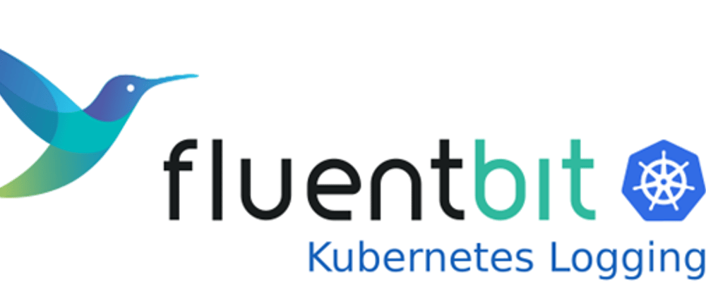

Observability is essential for any application, and the Smart-cash project is no exception. Previously [Prometheus](https://dev.to/aws-builders/adding-monitoring-to-eks-using-prometheus-operator-3ke1) was integrated for monitoring.

<!-- truncate -->

This article is part of a personal project called Smart-cash. Previous posts covered the deployment of [AWS and Kubernetes resources](https://dev.to/aws-builders/smartcash-project-infrastructure-terraform-and-github-actions-2bo3) and [how to install FluxCD](https://dev.to/aws-builders/smartcash-project-gitops-with-fluxcd-3aep) to implement GitOps practices.

## Project Source Code

The full project code can be found [here](https://github.com/danielrive/smart-cash/tree/develop), the project is still under development but you can find the terraform code to create AWS resources and also the Kubernetes manifest.

In this [link](https://github.com/danielrive/blog-posts/tree/main/Logging-EKS-FluentBit-CloudWatch) you can find the files used in this post

## Option 1. Export logs directly to Cloudwatch Logs(No Cloudwatch add-on)

The simplest configuration involves using Fluent-Bit's Tail Input, which reads the logs in the host **_/var/log/containers/*.log_** and sends them to Cloudwatch. This approach could be enough if you want to centralize the logs in CloudWatch or maybe another platform.

### Fluent-Bit installation

The Fluent-Bit Helm chart will be used in combination with FluxCD.

Adding the FluxCD source:

```yaml
kind: HelmRepository
metadata:
  name: fluent-bit
  namespace: flux-system
spec:
  interval: 10m0s
  url: https://fluent.github.io/helm-charts
```

#### Adding the Helm chart

The supported values for the Fluent-Bit Helm chart can be found [here](https://github.com/fluent/helm-charts/blob/main/charts/fluent-bit/values.yaml).

To use Fluent Bit with AWS, the following requirements must be met:

- **IAM Roles for Service Accounts (IRSA)**: You must set up an IAM role with permissions to create CloudWatch Logs streams and write logs. This role should be associated with the service account that Fluent Bit uses. AWS EKS Pod identity is also an option.
- **CloudWatch Log Group**: You can either create the CloudWatch Log group in advance or allow Fluent Bit to handle the log group creation.

The main configuration is shown below (some lines have been omitted for brevity). The full configuration file can be found [link](https://github.com/danielrive/blog-posts/tree/main/Logging-EKS-FluentBit-CloudWatch)

Fluent-Bit will run as a DaemonSet. The Helm chart will create the RBAC and the Service account, named fluent-bit, which will be annotated with the AWS IAM role with the appropriate CloudWatch permissions.

```yaml
apiVersion: helm.toolkit.fluxcd.io/v2beta1
kind: HelmRelease
###ommited-lines
spec:
  chart:
    spec:
      chart: fluent-bit
      version: 0.47.9
      ###ommited-lines
  values:
    kind: DaemonSet
    ###ommited-lines
    serviceAccount:
      create: true
      annotations: 
        eks.amazonaws.com/role-arn: arn:aws:iam::${ACCOUNT_NUMBER}:role/role-fluent-bit-${ENVIRONMENT}
    rbac:
      create: true
    ###ommited-lines
```

A volume is needed for Filesystem buffering, which helps to manage [backpressure and overall memory control](https://docs.fluentbit.io/manual/administration/buffering-and-storage#filesystem-buffering-to-the-rescue), also this is used to store the position (or offsets) of the log files being read, allowing Fluent Bit to track its progress and resume from the correct position if needed.

```yaml
extraVolumes:
      - name: fluentbit-status
        hostPath:
          path: /var/fluent-bit/state
    extraVolumeMounts:
      - name: fluentbit-status
        mountPath: /var/fluent-bit/state
```

Configs section defines the [Inputs](https://docs.fluentbit.io/manual/pipeline/inputs), [Filters](https://docs.fluentbit.io/manual/pipeline/filters), and [Outputs](https://docs.fluentbit.io/manual/pipeline/outputs) for collecting and processing data. For this scenario an Input of Tail type is configured to read the content of the files located at **_/var/log/containers/*.log_**. Let's break down the configuration details:

**Note:** AWS has some advanced configurations for inputs, filters and output, you can check this [link](https://raw.githubusercontent.com/aws-samples/amazon-cloudwatch-container-insights/main/k8s-quickstart/cwagent-operator-rendered.yaml)

The service section defines the global properties for Fluent-Bit, for this case:

- **Flush Interval**: Set to 1 second, meaning Fluent Bit will send the collected logs to the configured output destinations every second.

- **Log Level**: Set to Info, which includes informational messages as well as warnings and errors.

- The storage path for Filesystem buffering is the volume mounted in previous configurations with a backlog memory limit of 5M, which means that if Fluent-bit service reaches this limit, it stops loading any more backlog chunks from the storage path into memory.

```yaml
config:
  service: |
    [SERVICE]
      Daemon Off
      Flush  1
      Log_Level  info
      Parsers_File /fluent-bit/etc/parsers.conf
      Parsers_File /fluent-bit/etc/conf/custom_parsers.conf
      HTTP_Server On
      HTTP_Listen 0.0.0.0
      HTTP_Port  \{\{ .Values.metricsPort \}\}
      Health_Check On
      storage.path  /var/fluent-bit/state/flb-storage/
      storage.sync              normal
      storage.checksum          off
      storage.backlog.mem_limit 5M
```

Inputs define the data sources that Fluent Bit will collect logs from. In this scenario, the Tail input is used, which allows Fluent Bit to monitor one or more text files. Key points for this configuration include:

- In common Kubernetes environments, container runtimes store logs in the **_/var/log/pod/_** and **_/var/log/containers/_** (containers directory has symlinks to pod directory). Each log file follows a naming convention that includes key information like the pod name, namespace, container name, and container ID, for this case entries for fluent-bit, cloudwath-agent,kube-proxy, and aws-node will be ignored
- Some log entries may span multiple lines. Fluent Bit handles multi-line logs with built-in modes, and for this scenario, the Docker or CRI modes are used to process them correctly.
- To track the last line read from each log file, Fluent Bit uses a database to store this position. The database is saved in the previously mounted volume, ensuring that Fluent Bit can resume reading from the correct location.

```yaml
[INPUT]
   Name                tail
   Tag                 applications.*
   Exclude_Path        /var/log/containers/cloudwatch-agent*, /var/log/containers/fluent-bit*, /var/log/containers/aws-node*, /var/log/containers/kube-proxy*
   Path                /var/log/containers/*.log
   multiline.parser    docker, cri
   DB                  /var/fluent-bit/state/flb_container.db
   Mem_Buf_Limit       50MB
   Skip_Long_Lines     On
   Refresh_Interval    10
   storage.type        filesystem
   Rotate_Wait         30
```

Outputs define where the collected data is sent, and Fluent-Bit provides a plugin to send logs to CloudWatch.

- If you check the Input configurations there is a tag defined, **_applications.*_**. this helps to assign a label to the logs collected for that Input, in this case, it ensures that logs with this tag are routed to the specified output destination.
- CloudWatch log groups can be created by Fluent Bit, but in this scenario, the creation is disabled (set to off) since Terraform is used to manage log groups.
- The **_log_stream_prefix_** sets a prefix for the log streams created in CloudWatch, helping organize and identify the log entries within the stream.

```yaml
[OUTPUT]
   Name cloudwatch_logs
   Match applications.*
   region ${AWS_REGION} 
   log_group_name /aws/eks/${CLUSTER_NAME}/workloads
   log_stream_prefix from-k8-fluent-bit-
   auto_create_group off
```

Once you deploy the Helm chart you can check the CloudWatch service, if everything is working you should see some stream created, in this case out prefix is from-k8-fluent-bit-


and the log entry


#### Adding a filter

Filters in Fluent Bit allow you to enrich the data being collected. For instance, the Kubernetes Filter adds valuable metadata to log entries, such as namespace, pod_name, host, and more.

Here are some key points about the filter configuration:

- The Tag from the input configuration is reused here to extract information like pod_name, namespace, and other relevant metadata.

- The Kube_URL points to the Kubernetes API server, which Fluent Bit queries to obtain metadata about the pods involved in the logs. The path for the token and certificate is specified in Kube_CA_File and Kube_Token_File.

- You can configure the filter to include annotations and labels from the pods in the log entries.

**Note:** Be cautious about Fluent Bit querying the API server for metadata. In clusters with a high number of resources, [this can put an additional](https://aws.amazon.com/blogs/containers/capturing-logs-at-scale-with-fluent-bit-and-amazon-eks/) load on the API server. [One optimization](https://aws.amazon.com/blogs/containers/capturing-logs-at-scale-with-fluent-bit-and-amazon-eks/) is to retrieve pod metadata from the node’s kubelet instead of the kube-apiserver, but this requires enabling hostNetwork in the DaemonSet

```yaml
[FILTER]
   Name   kubernetes
   Match  applications.*
   Kube_URL      https://kubernetes.default.svc:443
   Kube_CA_File       /var/run/secrets/kubernetes.io/serviceaccount/ca.crt
   Kube_Token_File 
     /var/run/secrets/kubernetes.io/serviceaccount/token
   Kube_Tag_Prefix     application.var.log.containers.
   Merge_Log           On
   Merge_Log_Key       log_processed
   K8S-Logging.Parser  On
   K8S-Logging.Exclude Off
   Labels              On
   Annotations         Off
   Buffer_Size         0
```

After applying this filter the logs should have pods metadata


## Option 2. Use the amazon-cloudwatch-observability add-on

Container Insights can be used to collect, aggregate, and summarize both metrics and logs. If you plan to enable this in your EKS cluster, the Amazon CloudWatch Observability add-on installs the necessary resources to achieve this.

At a high level, the add-on installs two key components:

- A CloudWatch agent to collect metrics.
- Fluent-Bit to collect logs, using the [AWS for Fluent-bit container image](https://github.com/aws/aws-for-fluent-bit).

Both components are deployed as DaemonSets.

The add-on can be installed via Terraform or by using a [Helm-chart](https://github.com/aws-observability/helm-charts/blob/main/charts/amazon-cloudwatch-observability/values.yaml), Regardless of the method, you'll need to create an IAM role for the service account **_cloudwatch-agent_** in the **_amazon-cloudwatch_** namespace.

```hcl
resource "aws_eks_addon" "cloudwatch" {
  cluster_name                = aws_eks_cluster.kube_cluster.name
  addon_name                  = "amazon-cloudwatch-observability"
  addon_version               = ""v2.1.2-eksbuild.1""
  service_account_role_arn    = aws_iam_role.cloudwatch_role.arn 
  resolve_conflicts_on_update = "OVERWRITE"
}
```

The add-on creates several resources in the cluster, some of which you may not need. For example, if you list the DaemonSets in the amazon-cloudwatch namespace, you'll notice seven DaemonSets, some of which might have 0 replicas. While these resources may not be actively used, they still exist in your cluster and can create some noise.


You can customize the add-on configurations to suit your needs. For example, you can disable Fluent Bit logs for Accelerated Compute monitoring or skip collecting NVIDIA GPU metrics.

```hcl
resource "aws_eks_addon" "cloudwatch" {
  cluster_name                = aws_eks_cluster.kube_cluster.name
  addon_name                  = "amazon-cloudwatch-observability"
  addon_version               = ""v2.1.2-eksbuild.1""
  service_account_role_arn    = aws_iam_role.cloudwatch_role.arn 
  resolve_conflicts_on_update = "OVERWRITE"
  configuration_values = jsonencode({
    containerLogs = {
        enabled = true
    },    
    agent = {
      config = {
        logs = {
          metrics_collected = {
            application_signals = {},
            kubernetes = {
              "enhanced_container_insights": true
              "accelerated_compute_metrics": false
            }}}}}
  })
}
```

By default, the add-on creates four CloudWatch log groups. The following image, taken from the [AWS documentation](https://docs.aws.amazon.com/AmazonCloudWatch/latest/monitoring/Container-Insights-setup-logs-FluentBit.html#Container-Insights-FluentBit-setup), explains the naming structure of the log groups and the type of data each group stores.


To change expiration days and names for the groups is better to use the Helm chart instead of the Terraform code to install the add-on. You can do this by modifying the fluent-bit outputs.

The last log group is named performance and stores metrics collected by the CloudWatch agent, such as the number of running pods, CPU usage, and memory metrics.

### Bonus: Cluster dashboard

As mentioned earlier, the CloudWatch add-on collects, aggregates, and summarizes metrics. Once the add-on is installed, AWS automatically generates a dashboard that provides useful insights and metrics for your cluster.


You can watch metric per pod


It also generates a visual map that organizes Kubernetes resources by namespace.


